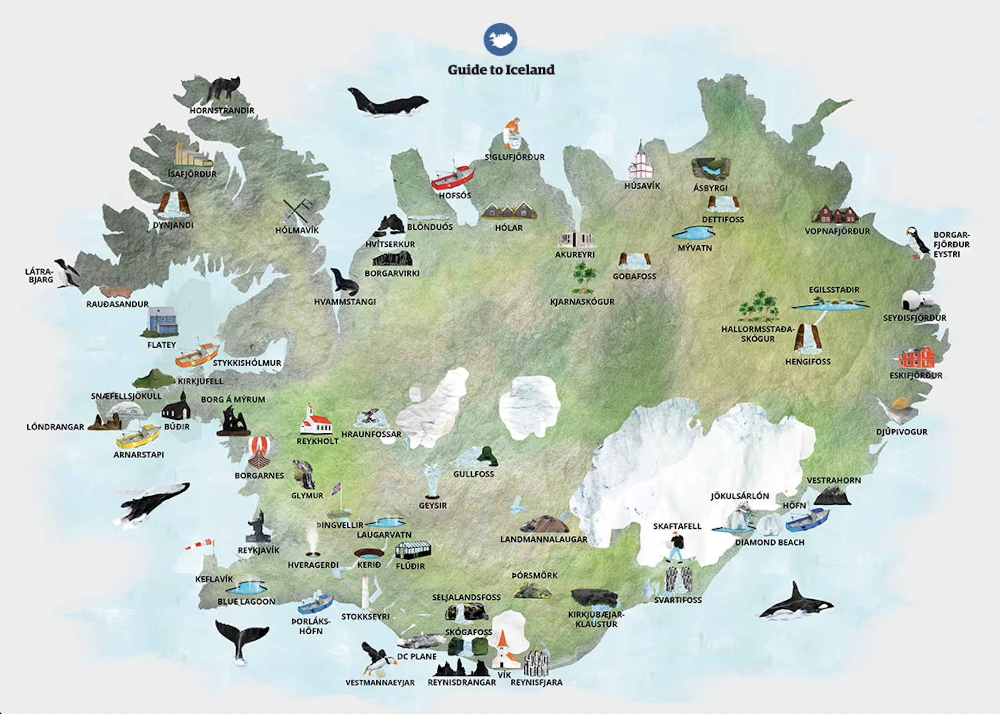
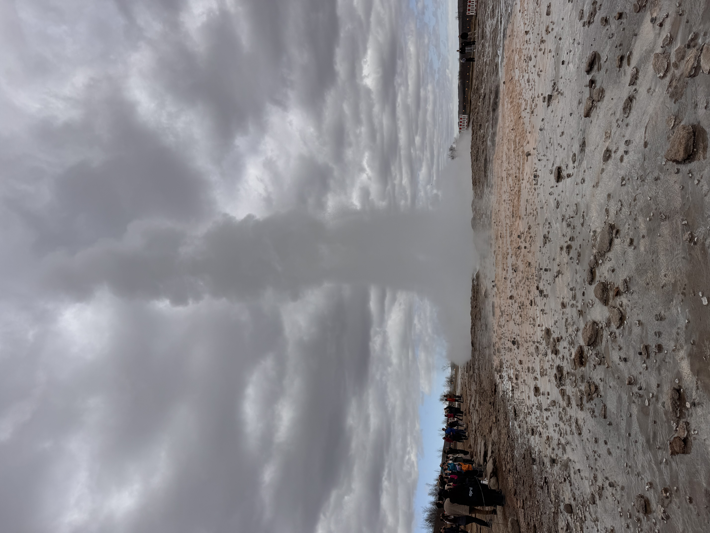

# Iceland Ring Road Challenge


A Pygame survival driving game set around Iceland's Ring Road. The player drives across Iceland, visits famous landmarks, and manages money, fuel, food, lodging, weather, vehicle stability, and speeding fines.

## Project Overview

This project was built as a Pygame practice project for learning how a 2D game is structured. It combines a driving game with a small travel-management system:

- Drive around Iceland using keyboard controls.
- Visit 13 checkpoints based on real Iceland locations.
- Manage fuel, money, food, life, and vehicle stability.
- Interact with restaurants, gas stations, lodging, and speed cameras.
- Use real map-style coordinates by converting latitude and longitude into screen pixels.

## Preview



| Reykjavik | Geysir | Gullfoss |
| --- | --- | --- |
|  |  |  |

| Skogafoss | Jokulsarlon | Kirkjufell |
| --- | --- | --- |
|  |  |  |

## How to Run

### Option 1: Windows batch file

Double-click:

```text
run_game.bat
```

The batch file uses the local Conda environment path configured for this computer:

```text
d:\Users\zhuqi\anaconda3\envs\rs_clean\python.exe
```

### Option 2: Command line

```bash
pip install -r requirements.txt
python main.py
```

## Controls

| Key | Action |
| --- | --- |
| Up / Down | Accelerate and brake |
| Left / Right | Steer the car |
| E | Eat near a restaurant |
| F | Refuel near a gas station |
| H | Rest and accommodate |
| R | Overnight risk mode |
| T | Show or hide task list |
| Esc | Quit |

## Game Goal

The player must visit all 13 checkpoints around Iceland. The trip is successful only if the player finishes without losing all life, running out of money, or running out of fuel away from a gas station.

## Main Code Structure

| File / Folder | Purpose |
| --- | --- |
| `main.py` | Main playable game: menu, game loop, map, player, UI, rules, and result screen |
| `iceland_game.py` | Earlier/backup game version |
| `icegame.py` | Small checkpoint-coordinate data file |
| `restaurants_iceland.json` | Restaurant interaction data |
| `assets/iceland_map.png` | Map image used as the game background |
| `assets/photos/` | Checkpoint photos shown during landmark visits |
| `assets/ui/` | Title image and UI artwork |

## Important Functions

### `main()`

The heart of the Pygame program. It starts the menu, loads data, creates the player, and runs the main game loop. Every frame it:

1. Reads keyboard and quit events.
2. Updates the player state.
3. Checks checkpoint, restaurant, gas station, speed camera, and route interactions.
4. Draws the map, car, UI, minimap, speedometer, and messages.
5. Calls `pygame.display.flip()` to show the new frame.

### `Player`

The main class for the car and survival state. It stores position, speed, angle, money, life, fuel, score, stability, time, fines, lodging cost, refuel count, and messages.

`Player.update()` controls the movement logic. It reads keyboard input, updates speed and direction, consumes fuel, advances time, applies weather effects, and prevents the car from entering the ocean.

### `geo_to_screen(lat, lon)`

Converts real latitude and longitude into Pygame pixel coordinates. Pygame cannot draw real-world coordinates directly, so this function maps Iceland's geographic bounding box onto the game window.

### `get_follow_camera(player)`

Calculates the camera position so the view follows the player's car. It applies zoom and clamps the camera inside the map boundaries.

### `world_to_view(x, y, camera)` and `geo_to_view(lat, lon, camera)`

These functions transform full-map coordinates into the current camera view. They make the follow-camera system work for checkpoints, roads, restaurants, gas stations, and the car.

### `point_in_polygon(point, polygon)`

Uses the ray-casting algorithm to decide whether a point is inside the Iceland land polygon. This helps the game detect whether the car is on land or in the ocean.

### `is_land_position(x, y)`

Checks several sample points around the car body. If any sample point is outside the land polygon, the car returns to its previous legal position.

### `screen_distance(a, b)`

Calculates the distance between two screen points. It is used for nearby-object detection, such as reaching checkpoints or interacting with restaurants and gas stations.

## Pygame Concepts Practiced

- Main game loop
- Event handling
- Keyboard input
- Drawing images, shapes, text, and UI
- Frame-rate control with `pygame.time.Clock`
- Sprite-like movement using speed and angle
- Collision and distance detection
- Coordinate transformation
- Resource-management gameplay
- Basic file loading with JSON and image assets

## Win and Lose Conditions

The player wins by visiting all checkpoints. The player loses if:

- Life reaches zero.
- Money reaches zero.
- Fuel reaches zero while the car is not near a gas station.

## Credits

This is a collaborative Pygame course practice project by Qinwei Zhu and Nuoya Wu.

- Qinwei Zhu: gameplay implementation, project cleanup, documentation, and GitHub preparation.
- Nuoya Wu: project collaboration, game concept support, and presentation preparation.
